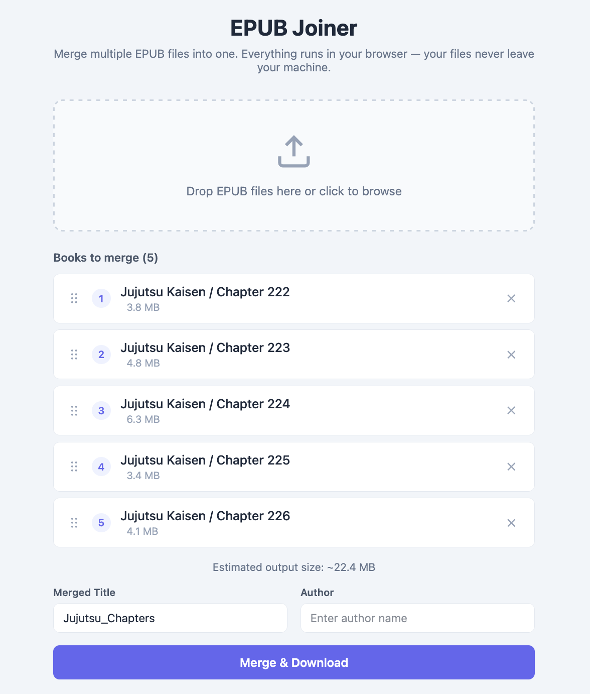

# EPUB Joiner



A browser-based tool to merge multiple EPUB files into one. No server, no uploads — everything runs locally in your browser.

## Features

- Drag-and-drop file upload
- Reorder books via drag-and-drop
- Merged table of contents with per-book sections
- Supports EPUB 2 and EPUB 3
- Estimated output size preview
- Instant download of the merged EPUB

## Demo

https://github.com/user-attachments/assets/demo.mov

Try it live: https://lisandrodimeo.github.io/epub_joiner/

## Getting Started

```bash
npm install
npm run dev
```

## Build

```bash
npm run build
```

The static output in `dist/` can be deployed anywhere (GitHub Pages, Netlify, etc.).

## Tech Stack

- Vue 3 + Vite
- JSZip
- vuedraggable
